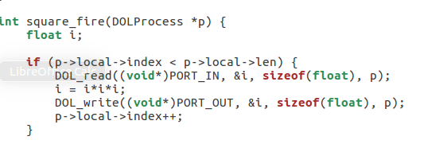
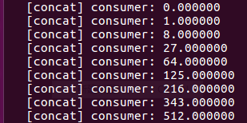
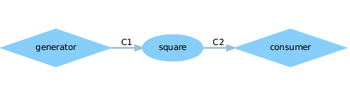
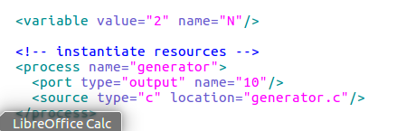
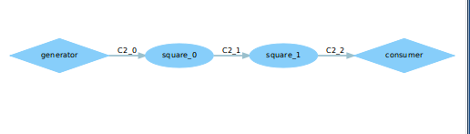

#Lab2: DOL实例分析&编程   
####author: Zhongsu Wan
##实验心得：  
example中各文件的含义：  
src文件夹：  
各进程（生产者，消费者，处理模块等）的功能定义，包含2种文件，*.c和与之对应的*.h，每个模块实现两个接口，xxx_init(Dolprocess *)和xxx_fire(Dolprecess*)  
example1.xml：  
系统架构即模块连接方式定义, process定义框, sw_channel定义线, connection定义连接 
___

##task one:  
description:  
修改example1，使其输出3次方数，tips:修改square.c   
 action:  
修改square中的i的变化，将`i=i*i;`该为`i=i*i*i;`  
  
result:  
  
    
##task two:  
description:  
修改example2，让3个square模块变成2个, tips:修改xml的iterator  
action:  
修改example2.xml中的迭代次数,将 `value="3"` 改为 `value="2"`   
  
result:  
  

***
  
  
##实验感想：    
本次实验使我懂得了安装的xdot， 并且用xdot去查看 *.dot 的文件 ，`sudo apt install xdot` 安装xdot， 然后 `xdot xxx.dot` 去打开相应的dot文件，也使我懂得了如何利用ant工具编译文件, `ant -f runexample.xml -Dnumber2` 去编译example2，`ant -f   runexample.xml -Dnumber3` 去编译example3。