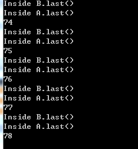
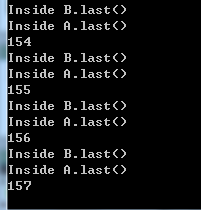
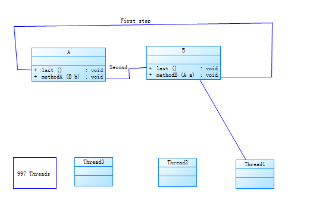

#Lab4:死锁   
##实验描述：  
运行本实验提供的Deadlock.java文件和Deadlock.bat文件，对最终产生的死锁进行分析  
##死锁样例：  
样例1：  
   
样例2：   
    
##死锁产生的条件：  
互斥条件：一个资源每次只能被一个进程使用  
请求与保持条件：一个进程因请求资源而阻塞时，对已获得的资源保持不放  
不剥夺条件:进程已获得的资源，在末使用完之前，不能强行剥夺  
循环等待条件:若干进程之间形成一种头尾相接的循环等待资源关系  
本实验原因分析：   

##执行过程分析：  
class A 和 class B 的方法都是 Sychronized ， 就是说当一个线程访问object的一个synchronized同步代码块或同步方法时，其他线程对object中所有其它synchronized同步代码块或同步方法的访问将被阻塞。
，而Sychronized得意义是  
*   当它用来修饰一个方法或者一个代码块的时候，能够保证在同一时刻最 多只有一个线程执行该段代码。  
*  当一个线程访问object的一个synchronized同步代码块或同步方法时，其他线程对object中所有其它synchronized同步代码块或同步方法的访问将被阻塞。  
实验中Thread1占用了方法A后，释放A然后占用了methodB，最后释放B，而Thread2方法再Thread1释放了methodA后可以占用methodA,但因为Thread1很快占用了methodB并调用了方法，执行了Second，马上就占用了class A 的last， 又由于last 和methodA 均为 Sychronized ，所以 Thread2 并不能马上占用methodA，当Thread1 释放了 last 后 Thread2马上占用了methodA,如此继续下去，当运行到后面第k次时，Threadk和Thread（k+1)同时占有资源， 即Threadk占有methodB，而Thread（k+1）占有了methodA，此时有两种可能：  
1. 当Threadk想去占用class A 的 last 时，Threadk发生了block，然后Thread（k+1）去占用class B 的 last 时，thread（k+1） 也发生了block。
2. 当Thread（k+1）想去占用class B 的 last 时，Thread（k+1）发生了block，然后Threadk去占用class A 的 last 时，threadk 也发生了block。  
在样例1中k为78，样例2中k为157

