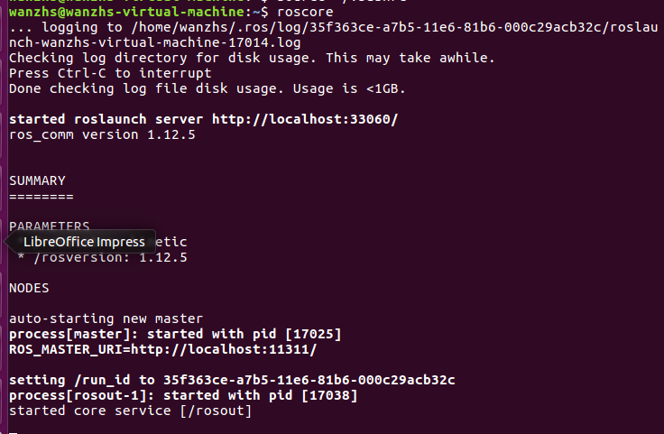
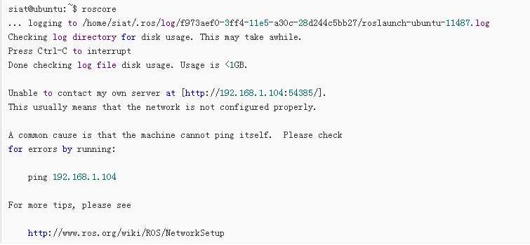
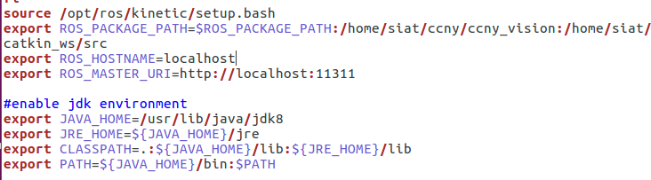

#Ubuntu 16.04环境下配置ROS
##实验环境
- Ubuntu16.04  
- Ubuntu联网   

##安装过程
添加source.list  
sudo sh -c 'echo "deb http://packages.ros.org/ros/ubuntu $(lsb_release -sc) main" > /etc/apt/sources.list.d/ros-latest.list'  
添加keys   
sudo apt-key adv --keyserver hkp://ha.pool.sks-keyservers.net:80 --recv-key 0xB01FA116   
 安装  
+ 首先确保虚拟机的Debian软件包索引是最新的  
+ `sudo apt-get update`  
+ 桌面完整版安装： 包含ROS、rqt、rviz、通用机器人函数库、2D/3D仿真器、导航以及2D/3D感知功能  
+   `sudo apt-get install ros-kinetic-desktop-full`  
+ 初始化rosdep:  
	sudo rosdep init  
	rosdep update    
+ 环境配置：如果每次打开一个新的终端时ROS环境变量都能够自动配置好（即添加到bash会话中）  
	 echo "source /opt/ros/kinetic/setup.bash" >> ~/.bashrc  
	source ~/.bashrc    
+ 如果你安装有多个ROS版本, ~/.bashrc 必须只能 source 你当 前使用版本所对应的 setup.bash。   
+ `source /opt/ros/kinetic/setup.bash`    
+ 如果你只想改变当前终端下的环境变量，可以执行以下命令安装rosinatall:rosinstall 是ROS中一个独立分开的常用命令行工具，它可以方便让你通过一条命令就可以给某个ROS软件包下载很多源码树。  
要在ubuntu上安装这个工具，请运行：    
`sudo apt-get install python-rosinstall`      
+ 至此，整个安装过程就结束了.  
##测试ROS
###打开一个终端，输入指令  
+ `roscore`  
+ 出现以下界面  
+     

##实验思考  
在实验过程中，出现了类似 以下错误 ：  
  
解决方法  
编辑~/.bashrc文件，具体方法如下：    
`gedit ~/.bashrc`  
在.bashrc中加入：  
	export ROS_PACKAGE_PATH=$ROS_PACKAGE_PATH:/home/siat/ccny/ccny_vision:/home/siat/catkin_ws/src    
	export ROS_HOSTNAME=localhost    
	export ROS_MASTER_URI=http://localhost:11311     
如下图所示：    
   
