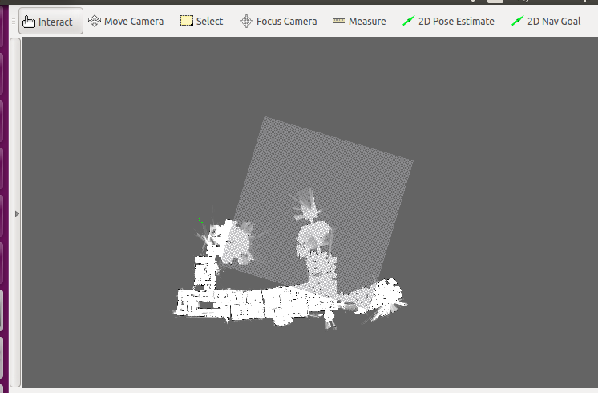

#Ubuntu 16.04环境下配置ROS
##实验环境
- Ubuntu16.04  
- Ubuntu联网  

##安装过程

1. 首先安装ceres solver，选择的版本是1.11,路径随意  
	git clone https://github.com/hitcm/ceres-solver-1.11.0.git  
	cd ceres-solver-1.11.0/  
	mkdir build  
	cd build  
	cmake ..  
	make   
	sudo make install  
2. 然后安装 cartographer,路径随意  
    git clone https://github.com/hitcm/cartographer.git  
    cd cartographer  
	mkdir build  
	cd build  
    cmake .. -G Ninja  

method1:  
    ninja  
    ninja test  
    sudo ninja install  
method2:  
    make  
    sudo make install  

3. 安装cartographer_ros。  

谷歌官方提供的安装方法比较繁琐，我对原来的文件进行了少许的修改，核心代码不变，只是修改了编译文件  

下载到catkin_ws下面的src文件夹下面  

git clone https://github.com/hitcm/cartographer_ros.git

然后到catkin_ws下面运行catkin_make即可。  
4. 综合处理ROS  
  把ceres solver 和  cartographer移动到 catkin_ws下面的src文件夹下面，然后到catkin_ws下面运行catkin_make即可。    
5. 数据下载测试  
2d数据，大概500M  
[https://storage.googleapis.com/cartographer-public-data/bags/backpack_2d/cartographer_paper_deutsches_museum.bag](https://storage.googleapis.com/cartographer-public-data/bags/backpack_2d/cartographer_paper_deutsches_museum.bag)  
3d数据，8G左右    
[https://storage.googleapis.com/cartographer-public-data/bags/backpack_3d/cartographer_3d_deutsches_museum.bag](https://storage.googleapis.com/cartographer-public-data/bags/backpack_3d/cartographer_3d_deutsches_museum.bag)  
然后把下载的数据复制到Ubuntu的downloads目录下  
6. 测试数据  
在Terminal中运行相应的指令  
2d：  
roslaunch cartographer_ros demo_backpack_2d.launch bag_filename:=${HOME}/Downloads/cartographer_paper_deutsches_museum.bag  
3d：  
roslaunch cartographer_ros demo_backpack_3d.launch bag_filename:=${HOME}/Downloads/cartographer_3d_deutsches_museum.bag  
  
##错误解决方案  
[https://www.cnblogs.com/hitcm/p/5939507.html](https://www.cnblogs.com/hitcm/p/5939507.html)  
##实验结果  
  