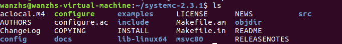

# DOL开发环境配置 
***
#### Author:Zhongsu,Wan
***
## Descriptio 
DOL 是一个使得程序并行使用的软件开发框架.DOL许可提出基于计算的Kahn进程网络模型和有着基于SystemC的仿真引擎的特色.而且,DOL提供了一种XML的规范格式去描述在一个多处理器系统上并行程序的执行情况,包括绑定和映射  
***
## Install

#####*  首先，安装一些必要的环境（本次实验使用的是ubuntu）
  
$	`sudo apt-get update`  
$	`sudo apt-get install ant`  
$ 	`sudo apt-get install openjdk-8-jdk`  
$	`sudo apt-get install unzip`  
#####*  安装jdk-8u40-linux-x64  
 a. 将安装包解压到 /usr/lib/java
  
      `cd /usr/lib  `
      `sudo mkdir java  `
     进入安装包下载所在路径(在终端打开)  
      `sudo tar zxvf ./jdk-8u40-linux-x64.gz -C /usr/lib/java`  
      重命名为jdk8   
      `cd /usr/lib/java`  
      `sudo mv jdk1.8.0_40/ jdk8`  
   b.配置环境变量  
     `gedit ~/.bashrc ` 
     在打开的文件的末尾添加  
     JDK所在路径  
      enable jdk environment  

     export JAVA_HOME=/usr/lib/java/jdk8  
     export JRE_HOME=${JAVA_HOME}/jre  
     export CLASSPATH=.:${JAVA_HOME}/lib:${JRE_HOME}/lib  
     export PATH=${JAVA_HOME}/bin:$PATH  
    保存退出，然后输入下面的命令来使之生效  
    `source ~/.bashrc`  
   c.配置默认JDK  
     /usr/lib/java/jdk8/为JDK所在路径 
 
    sudo update-alternatives --install /usr/bin/java java /usr/lib/java/jdk8/bin/java 300  
    sudo update-alternatives --install /usr/bin/javac javac /usr/lib/java/jdk8/bin/javac 300  
     查看当前各种JDK版本和配置: 链接组 java (提供 /usr/bin/java)中如果只有一个候选项：/usr/lib/java/jdk8/bin/java，则无需配置。  
    `sudo update-alternatives --config java` 	# 查看当前各种JDK版本和配置  
   d. 通过一下命令验证配置是否成功
  
    java -version	# 查看JDK版本  
    java  
    javac   
  
#####*  Build environment: make, Ant  
[参考：](http://www.cnblogs.com/shitouer/archive/2011/08/31/2160467.html)  
方法一：自动安装 
 sudo apt-get install ant  
缺点：安装的不一定是最新版本，且安装不一定成功  
方法二：手动安装  
    1. 到Apache官网下载最新版本的ant：[http://ant.apache.org/bindownload.cgi](http://ant.apache.org/bindownload.cgi)  
    2. 解压下载下来的.tar.gz文件： `tar -xf apache-ant-1.9.7-bin.tar.gz`  
    3. 将解压出来的文件移动到/opt/下：`sudo mv apache-ant-1.9.7 /opt/`   
    4. 配置环境变量：sudo gedit /etc/profile，在原来基础上添加以下蓝体字：

     export ANT_HOME=/opt/apache-ant-1.9.7
     export PATH=$PATH:${ANT_HOME}/bin
     or 
	 export PATH=$PATH:/opt/apache-ant-1.9.7/bin
    5. 验证是否安装成功： ant -version  
    `Apache Ant(TM) version 1.9.7 compiled on April 9 2016`  
    如此字样，则表示安装成功  
  
#####* 安装SystemC  
a.  安装与配置  
`tar systemc-2.3.1`     解压缩  
解压后进入systemc-2.3.1的目录下  
	`cd systemc-2.3.1  `  
新建一个临时文件夹objdir  
	`mkdir objdir`  
进入该文件夹objdir  
	`cd objdir`    
运行configure   
	`../configure  --disable-async-updates`  
编译  
 `sudo make install`  
编译完后（$cd .. $ls )文件目录：  
ls  
  
pwd  

地址有用（稍后）
    
#####*  配置后期dol   
将文件dol_ethz.zip下载后放进ubuntu里
在主目录下创建dol文件夹  
`mkdir dol`  
将dolethz.zip解压到 dol文件夹中  
`unzip dol_ethz.zip -d dol`  
进入刚刚dol的文件夹  
	`cd ../dol`  
修改build_zip.xml文件  
找到下面这段话，就是说上面编译的systemc位置在什么地方    
`<property name="systemc.inc" value="YYY/include"/> `   `<property name="systemc.lib" value="YYY/lib-linux64/libsystemc.a"/>`    
把YYY改成上页pwd的结果（注意:对于32位系统的机器,lib-linux64要改成lib-linux）  
编译  $ `ant -f build_zip.xml all`  
成功会显示build successful  
`ant -f build_zip.xml all`    
  
接着可以试试运行第一个例子  
	`cd /build/bin/main`  
	`ant -f runexample.xml -Dnumber=1`  
  
***
##Experimental experience  
通过本次实验,更深的知道了ubuntu环境变量的概念,如:用":"表示不同环境变量的分隔,$表示提取变量值,本次实验也让我知道了update-alternatives的一些用法，用来配置版本信息，update-alternatives --config java 用来配置java的默认版本

